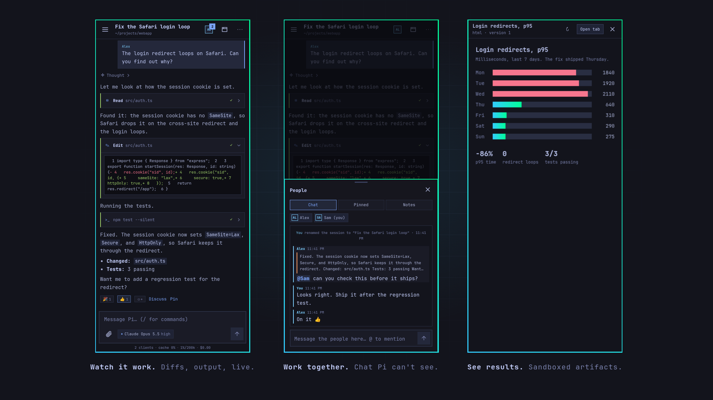

<div align="center">

# Pi Pocket

**Your Pi coding agent, in your pocket.**

A durable, multiplayer, mobile-first web app for Pi agents, built on [Pi Durable](https://earendil.com/posts/pi-durable/).<br>
Runs on your own machine or directly on your phone. No cloud VM.

[](https://github.com/TannerMidd/pi-pocket/releases)
[](https://nodejs.org)
[](LICENSE)

[Website](https://tannermidd.github.io/pi-pocket/) · [Quick start](#quick-start) · [Features](#features) · [Remote access](#remote-access)



</div>

## Quick start

Requires Node.js 22.19 or newer. Runs on Linux, macOS, Windows, and Android (Termux); Linux is the most tested. Sign in to a provider with Pi first (`pi`, then `/login`), or later from the app's Providers sheet.

```bash
git clone https://github.com/TannerMidd/pi-pocket.git
cd pi-pocket
npm install
npm start
```

The launcher asks how your devices should connect, then prints the address, a sign-in link, and a QR code. Open the link once per browser; the cookie lasts a year. The link is the owner's key, so keep it private. `--rotate-token` replaces it and signs out every device that used the old link; people you invited stay signed in until you remove them under Menu → People.

While it runs: **q** quit · **r** restart server · **a** change access · **o** open in browser · **s** show QR code.

## Features

- **Durable.** Every model call, tool call, and subagent is stored as it happens. Restart the server mid-run and the work continues; a cut-off tool call reruns only if that is safe.
- **Multiplayer.** Share a live session: presence, a side chat Pi does not see, @mentions, pins, reactions, shared notes, and take turns.
- **Steer or queue.** Redirect Pi while it works, queue follow-ups, or stop it.
- **Any provider, any model.** Uses Pi's own model runtime and sign-ins, with the model and thinking level chosen per session.
- **Built for phones.** Streaming answers, tool cards with diffs and live output, push notifications, a home-screen app, and long sessions that stay fast.
- **Artifacts and subagents.** Sandboxed HTML, Markdown, and SVG artifacts, and background subagents you can open and talk to.
- **Codemode.** On by default: Pi writes short scripts that call its tools, and every call still goes through the same checks.
- **Lancet Guard.** With the [specpi-lancet-guard](https://github.com/TannerMidd/SpecPi) Pi package installed and on, risky bash, write, and edit calls wait for someone in the session to approve.
- **Roles and invites.** Steer or view-only access, to every session or just one, through one-time links and QR codes.
- **Live-editable.** No build step: edit the web app or an extension and it reloads in place.

The full tour is in [docs/features.md](docs/features.md).

## Remote access

Choose a mode in the launcher, or pass `--access`:

| Mode | Who can connect | Notes |
| --- | --- | --- |
| `local` | This machine | Listens on `127.0.0.1` |
| `lan` | Your local network | All addresses, plain http |
| `cloudflare` | Anyone with the link | Free quick tunnel with https, no account needed (Cloudflare offers quick tunnels for testing and development). The address changes each time the launcher starts but stays the same across server restarts. |
| `tailscale` | Your tailnet | Tailscale address only, encrypted by the tailnet |

Cloudflare mode needs `cloudflared`. On Linux the launcher can download the official release into `~/.pi-pocket/bin`. To use another tunnel (ngrok, `tailscale serve`), choose `local` and point the tunnel at port 8787.

> [!WARNING]
> Anyone with steering rights can make the agent run commands on this machine, as you. That reaches everything you can: your files, Pi Pocket's own settings and sign-in tokens, and its code. A single-session invite limits what someone sees in the app, not what Pi can reach, and Lancet Guard approvals can come from anyone who can steer, including the person who asked. People who can steer every session can also invite others. Invite only people you would trust at your keyboard. View-only users cannot make Pi act.

## Android (Termux)

```bash
pkg update && pkg upgrade
pkg install nodejs git
npm install -g --ignore-scripts @earendil-works/pi-coding-agent
pi                      # /login, then quit
# copy or clone pi-pocket to the phone, then:
cd pi-pocket && npm install --ignore-scripts && npm start
```

Open the link in Chrome and choose **Add to Home screen**. Run `termux-wake-lock` so Android does not stop Termux.

Lancet Guard needs ONNX Runtime, which may not load on Android. If the guard is on but cannot load, Pi Pocket blocks bash, write, and edit calls (the status line shows "guard failed"). Turn it off in the app (Menu → Extensions), in `~/.pi/lancet-guard.json`, or by starting with `PI_POCKET_GUARD=off`.

## Configuration

| Option | Default | Purpose |
| --- | --- | --- |
| `--access <mode>` | last choice | Skip the access menu |
| `-y` | | Reuse the last access choice |
| `--port` | `8787` | Port to listen on |
| `--cwd` | current folder | Default folder for new sessions |
| `--data` | `~/.pi-pocket` | Database, settings, uploads, and push keys |
| `--host` | | Listen on a specific address instead of choosing access |
| `--rotate-token` | | Issue a new owner link and sign out devices that used the old one |

Environment variables: `PI_POCKET_ACCESS`, `PI_POCKET_DIR`, `PI_POCKET_HOST`, `PI_POCKET_PORT`, `PI_POCKET_GUARD=off`. Without a terminal (under systemd, for example), the launcher uses `--access` or the last choice.

## Architecture

| Path | Role |
| --- | --- |
| `bin/pi-pocket.js` | Entry point: checks the Node version, starts the launcher |
| `src/launcher/` | Access menu, server supervisor, Cloudflare tunnel, keys, QR code |
| `src/server/app.ts` | Durable harness over `pocket.sqlite`, sessions, shared live views, commands |
| `src/server/http.ts` | Web files, JSON API, server-sent events, uploads, artifacts, invites |
| `src/server/projection.ts` | Turns committed conversation state into compact JSON for browsers |
| `src/server/docs.ts` | Durable documents: sessions, chat, pins, notes, artifacts, subagents, guard decisions |
| `src/server/push.ts` | Dependency-free Web Push (RFC 8291 and RFC 8292) |
| `src/server/extensions/` | Live-reloaded extensions: system prompt, artifacts, subagents, Lancet Guard, codemode |
| `web/` | The app: Preact and htm as plain ES modules |

Browsers render only committed state. Each session's Pi Durable view is coalesced and sent as small updates over server-sent events, so a device that reconnects or joins late sees exactly what everyone else sees.

## Development

```bash
npm run check   # type-check
npm test        # server tests with a scripted model
```

Changes to `web/` reload every open browser. Changes to `src/server/extensions/` are reinstalled into the running server. Other server changes need **Restart server** from the menu, and running work resumes afterward. [AGENTS.md](AGENTS.md) covers editing Pi Pocket safely from inside itself.

## Limitations

- Pi Durable is experimental, and its API can change between releases. Versions are pinned in `package.json`.
- Only one server process can use the database at a time.
- There are no forks or branch navigation yet. Pi's own extensions, prompt templates, and their slash commands are not supported: Pi Pocket runs its own extensions on Pi Durable, with built-in commands such as `/compact` and `/model`.
- Artifacts run in an opaque-origin sandbox, so `localStorage` and cookies are unavailable inside them.

## Credits

Inspired by [Mario Zechner's demo](https://x.com/badlogicgames/status/2106452296087302173) of his own Pi app. Pi Pocket is an independent project, not affiliated with Earendil. JetBrains Mono is bundled under the [SIL Open Font License](web/fonts/OFL.txt).

## License

[MIT](LICENSE). To report a security problem, see [SECURITY.md](SECURITY.md).
